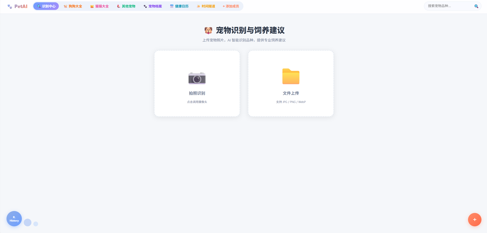
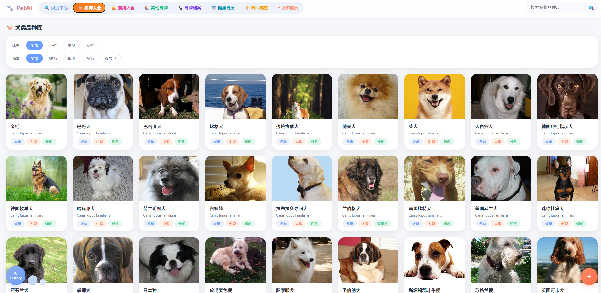
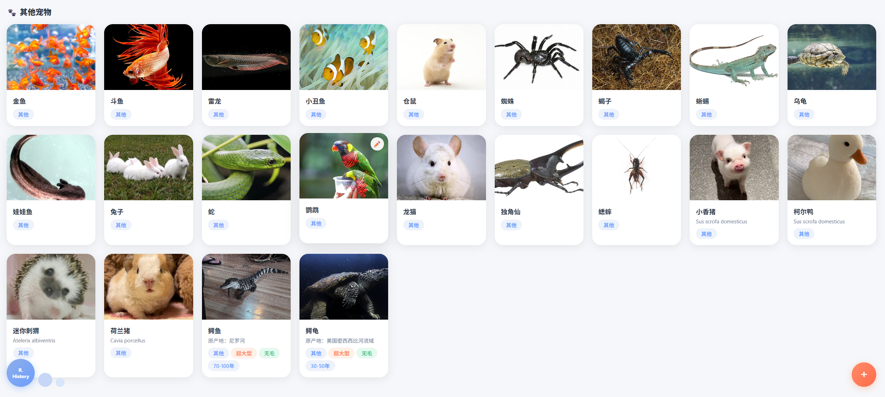
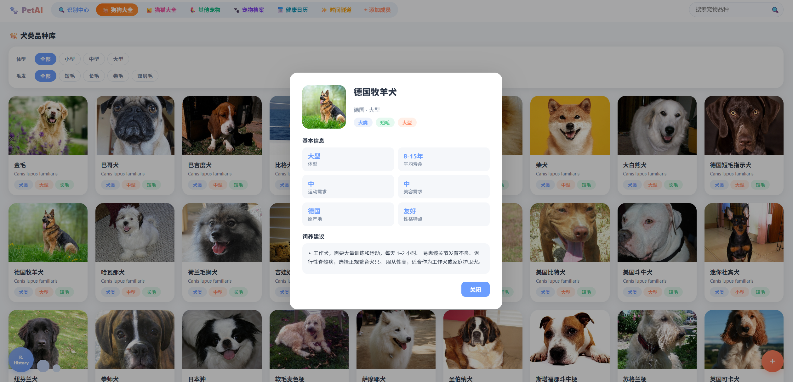
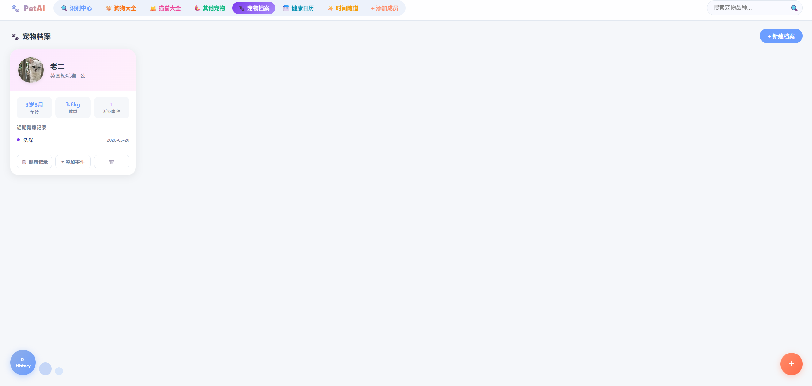
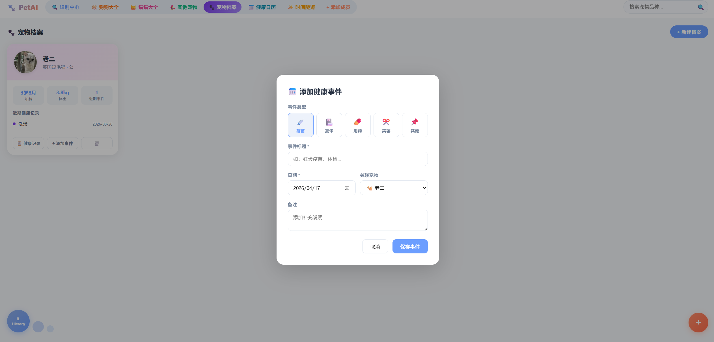
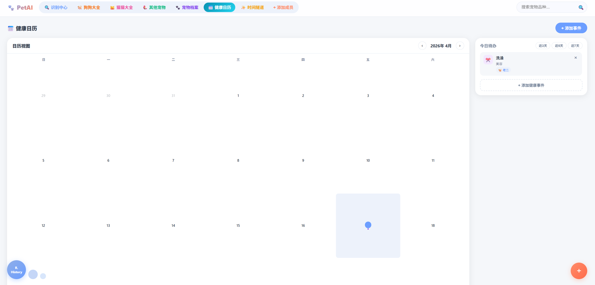
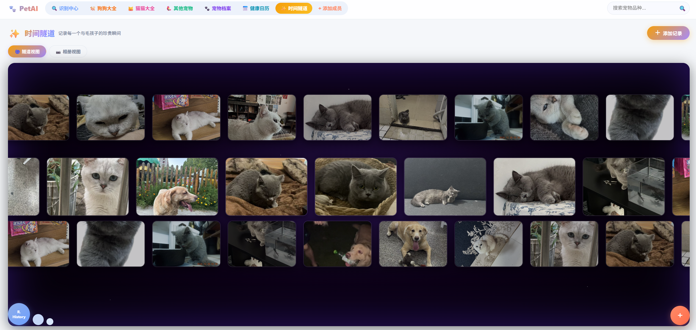

# 🐾 Pet&Recognition — 基于深度学习的宠物识别与检测系统

<div align="center">


**本科毕业设计 · 人工智能学院**

作者：Mwh040118 &nbsp;|&nbsp;

</div>

---

## 📖 项目简介

这是一个基于深度学习（ResNet18）的**宠物识别与管理系统**，支持 53 种宠物的主类分类，以及对猫狗进行 16 个精细品种的二级识别。系统提供两种运行方式：

- 🖥️ **桌面端**（PyQt5 GUI）：`main.py`，本地窗口应用
- 🌐 **Web 端**（Flask + 单页应用）：`web_app.py`，浏览器访问 `http://localhost:5000`

主要功能涵盖：实时摄像头识别、图片上传识别、宠物百科管理、宠物档案、每日提醒、健康日历、识别历史、时间隧道相册等。

---

## ✨ 功能特性

| 功能 | 说明 |
|------|------|
| 🐾 **实时摄像头识别** | 每 5 帧触发一次识别，置信度 ≥ 70% 弹出确认写入记录 |
| 📷 **图片上传识别** | 支持 JPEG/PNG/GIF/BMP/TIFF/WebP/ICO 等多种格式 |
| 🏷️ **双模型级联识别** | 先识别主类（53类），猫/狗再触发品种精细识别（16类） |
| 📚 **宠物百科数据库** | 完整 CRUD 管理，含图片、学名、科目、饲养建议等字段 |
| 🐕 **我的宠物档案** | 多档案管理，支持头像、生日、体重、健康笔记 |
| ✅ **每日提醒** | 早晚喂食、补充饮水、梳毛清洁等勾选提醒 |
| 📅 **健康日历** | 疫苗复查、体内驱虫日期倒计时提示 |
| 📜 **识别历史记录** | 自动保存每次识别结果、来源、时间、置信度 |
| ⏳ **时间隧道** | 宠物成长相册，多图时光记录功能（Web 端） |

---

## 🏗️ 系统架构

```
┌─────────────────────────────────────────────────────┐
│               采集与交互层                            │
│   PyQt5 GUI  /  Web 前端（Vanilla JS SPA）           │
├─────────────────────────────────────────────────────┤
│               推理服务层                              │
│   主类模型 ResNet18(53类) → 条件品种模型(16类)        │
│   OpenCV 图像预处理 → softmax 置信度输出             │
├─────────────────────────────────────────────────────┤
│               数据与知识层                            │
│   SQLite 数据库 (7张表)  /  breed_info.json          │
└─────────────────────────────────────────────────────┘
```

---

## 🛠️ 技术栈

### 后端 / 核心
| 技术 | 版本 | 用途 |
|------|------|------|
| **Python** | 3.8+ | 主语言 |
| **PyTorch** | 2.x | 深度学习推理框架 |
| **torchvision (ResNet18)** | — | 预训练模型结构（ImageNet 微调） |
| **Flask + Flask-CORS** | — | Web REST API 服务 |
| **SQLite** | — | 轻量级本地数据库 |
| **OpenCV (cv2)** | — | 摄像头采集、图像预处理 |
| **Pillow (PIL)** | — | 多格式图片处理、EXIF 旋转修正 |
| **NumPy** | — | 数值计算 |
| **Matplotlib + Seaborn** | — | 训练曲线、混淆矩阵图表 |
| **psutil** | — | 系统性能监控 |
| **python-docx** | — | 论文 Word 文档生成 |

### 桌面端
| 技术 | 用途 |
|------|------|
| **PyQt5** | 桌面 GUI（QMainWindow、QDialog、QTimer） |

### 前端（Web）
| 技术 | 用途 |
|------|------|
| **原生 HTML5 / CSS3 / JavaScript** | 单页应用，无框架，Fetch API 调用后端 |

---

## 🤖 模型信息

| 模型 | 文件 | 大小 | 类别数 | 架构 |
|------|------|------|--------|------|
| 主分类模型 | `model/pet_model.pth` | 42.81 MB | 53 类 | ResNet18 |
| 品种精细模型 | `model/breed_model.pth` | 42.74 MB | 16 类 | ResNet18 |

### 训练结果

使用 ResNet18 + AdamW 优化器 + CosineAnnealingLR，共训练 10 个 Epoch，batch_size=32：

| Epoch | 训练 Loss | 训练 Acc | 验证 Loss | 验证 Acc |
|-------|-----------|----------|-----------|----------|
| 1 | 1.339 | 62.40% | 1.143 | 67.29% |
| 3 | 0.662 | 79.91% | 0.546 | 83.19% |
| 5 | 0.389 | 87.94% | 0.268 | 91.18% |
| 7 | 0.185 | 94.20% | 0.094 | 97.19% |
| 8 | 0.115 | 96.26% | 0.054 | 98.54% |
| **10** | **0.064** | **98.18%** | **0.032** | **99.24%** |

**最终验证准确率：99.24%** 🎉

### 识别类别

<details>
<summary>点击展开完整类别列表（53 类）</summary>

**🐕 犬类（25 种）**
> 美国斗牛犬、美国比特犬、巴吉度犬、比格犬、拳师犬、吉娃娃、英国可卡犬、英国雪达犬、德国短毛指示犬、大白熊犬、哈瓦那犬、日本狆、荷兰毛狮犬、兰伯格犬、迷你杜宾犬、纽芬兰犬、博美犬、巴哥犬、圣伯纳犬、萨摩耶犬、柴犬、斯塔福郡斗牛梗、苏格兰梗、软毛麦色梗、约克夏梗

**🐱 猫类（12 种）**
> 阿比西尼亚猫、孟加拉猫、伯曼猫、孟买猫、英国短毛猫、埃及猫、缅因猫、波斯猫、布偶猫、俄罗斯蓝猫、暹罗猫、斯芬克斯猫

**🐾 其他（16 种）**
> 乌龟、仓鼠、兔子、娃娃鱼、小丑鱼、昆虫、斗鱼、蛇、蜘蛛、蜥蜴、蝎子、金鱼、雷龙、马、鸟类、龙猫

</details>

<details>
<summary>品种精细模型类别（16 类，仅猫狗触发）</summary>

> 伯曼猫、俄罗斯蓝猫、博美犬、吉娃娃、埃及猫、孟买猫、孟加拉猫、巴哥犬、布偶猫、斯芬克斯猫、暹罗猫、波斯猫、缅因猫、英国短毛猫、阿比西尼亚猫、龙猫

</details>

---

## 📁 目录结构

```
pet_recognition_system/
├── main.py                 # 🖥️ 桌面端主程序（PyQt5 GUI）
├── web_app.py              # 🌐 Web 后端（Flask REST API）
├── web_index.html          # 📄 Web 前端单页应用（~132KB）
├── config.py               # ⚙️ 全局路径配置
├── database.py             # 🗄️ 数据库 CRUD 封装
├── model_loader.py         # 📦 模型加载器
├── recognizer.py           # 🧠 推理核心（predict 函数）
├── train.py                # 🏋️ 模型训练脚本
├── init_data.py            # 📥 初始数据导入
├── generate_figures.py     # 📊 论文图表生成
├── perf_benchmark.py       # ⏱️ 性能基准测试
├── check_db.py             # 🔍 数据库检查工具
├── check_server.py         # 🔌 服务器接口测试
├── gen_thesis.py           # 📝 论文 Word 文档生成（Python）
├── gen_thesis.js           # 📝 论文 Word 文档生成（Node.js）
├── requirements.txt        # 📋 Python 依赖列表
│
├── model/                  # 🤖 模型文件目录
│   ├── pet_model.pth       # 主分类模型（53类，~43MB）
│   ├── breed_model.pth     # 品种模型（16类，~43MB）
│   ├── class_names.json    # 主分类类别名
│   ├── breed_class_names.json  # 品种类别名
│   ├── breed_info.json     # 品种详细信息（饲养建议等）
│   └── train_log.json      # 训练日志
│
├── database/
│   └── pets.db             # SQLite 数据库文件
│
├── dataset/                # 训练/测试数据集（ImageFolder 格式）
│   ├── train/              # 训练集（53个类别）
│   ├── test/               # 测试集
│   └── val/                # 验证集
│
├── data/
│   └── pets.json           # 初始宠物数据
│
├── uploads/                # 用户上传/识别图片存储
├── figures/                # 生成的论文图表
├── icons/                  # 桌面端图标
└── venv/                   # Python 虚拟环境
```

---

## 🚀 快速开始

### 环境要求

- Python 3.8+
- （可选）NVIDIA GPU + CUDA（无 GPU 也可运行，仅速度稍慢）

### 1. 克隆项目

```bash
git clone https://github.com/your-username/pet_recognition_system.git
cd pet_recognition_system
```

### 2. 创建虚拟环境（推荐）

```bash
python -m venv venv

# Windows
venv\Scripts\activate

# macOS / Linux
source venv/bin/activate
```

### 3. 安装依赖

```bash
pip install -r requirements.txt

# 补充安装 Web 后端依赖
pip install flask flask-cors

# 如需运行桌面端（PyQt5）
pip install PyQt5
```

### 4. 运行系统

#### 方式一：Web 端（推荐，功能最完整）

```bash
python web_app.py
```

启动后访问 **http://localhost:5000** 即可使用全部功能。

#### 方式二：桌面端（PyQt5 GUI）

```bash
python main.py
```

---

## 📡 API 接口文档

> Web 端后端（Flask）提供以下 REST API

### 系统接口

| 方法 | 路径 | 说明 |
|------|------|------|
| `GET` | `/` | Web 前端首页 |
| `GET` | `/uploads/<filename>` | 获取上传图片 |
| `GET` | `/api/model_status` | 模型加载状态 |

### 识别接口

| 方法 | 路径 | 说明 |
|------|------|------|
| `POST` | `/api/recognize` | 宠物图片识别，支持 `multipart/form-data`（`file` 字段）或 JSON base64（`image_base64` 字段） |
| `GET` | `/api/breed_info?label=xxx` | 查询品种详细信息 |

**识别返回示例：**
```json
{
  "main_label": "萨摩耶犬_samoyed",
  "confidence": 92.5,
  "breed_label": null,
  "breed_conf": 0,
  "category": "dogs",
  "img_url": "/uploads/xxx.jpg",
  "breed_info": {
    "name": "萨摩耶犬 Samoyed",
    "diet": "...",
    "care_tips": "..."
  }
}
```

### 宠物百科接口

| 方法 | 路径 | 说明 |
|------|------|------|
| `GET` | `/api/pets` | 获取全部宠物（支持 `?category=dogs/cats/other`、`?q=关键词`） |
| `POST` | `/api/pets` | 新增宠物（支持图片上传） |
| `PUT` | `/api/pets/<pet_id>` | 更新宠物信息 |
| `DELETE` | `/api/pets/<pet_id>` | 删除宠物 |

### 宠物档案接口

| 方法 | 路径 | 说明 |
|------|------|------|
| `GET` | `/api/profiles` | 获取所有档案 |
| `POST` | `/api/profiles` | 新建档案（支持头像上传） |
| `PUT` | `/api/profiles/<pid>` | 更新档案 |

### 辅助功能接口

| 方法 | 路径 | 说明 |
|------|------|------|
| `GET` | `/api/records` | 获取识别历史（`?limit=50`） |
| `GET/PUT` | `/api/reminders[/<rid>]` | 每日提醒（获取/更新完成状态） |
| `GET/POST` | `/api/health` | 健康日历（获取/新增事件） |
| `GET/POST` | `/api/tunnel` | 时间隧道（获取/新建记录，支持多图上传） |
| `DELETE` | `/api/tunnel/<record_id>` | 删除时光记录 |

---

## 🗄️ 数据库设计

使用 SQLite，共 **7 张表**：

```
database/pets.db
├── pets                # 宠物百科（id, category, name, scientific_name, advice, image_path, ...)
├── pet_profiles        # 宠物档案（多档案，含头像/生日/体重/健康笔记）
├── pet_profile         # 旧版单档案（兼容保留）
├── daily_reminders     # 每日提醒
├── health_calendar     # 健康日历
├── recognition_records # 识别历史记录
├── tunnel_records      # 时间隧道主记录
└── tunnel_images       # 时间隧道图片（外键关联）
```

---

## 🔬 模型训练（可选）

如需自行训练模型：

```bash
# 1. 准备数据集（ImageFolder 格式）
# dataset/train/<类别名>/<图片>
# dataset/test/<类别名>/<图片>

# 2. 运行训练
python train.py

# 模型将保存至 model/pet_model.pth
# 训练日志保存至 model/train_log.json
```

**训练配置：**
- 模型：ResNet18（ImageNet 预训练权重微调）
- 优化器：AdamW（lr=0.001, weight_decay=1e-4）
- 调度器：CosineAnnealingLR
- Epoch：10，batch_size：32
- 数据增强：随机裁剪、水平翻转、旋转、颜色抖动

---

## 🛠️ 辅助脚本

```bash
# 生成论文图表（混淆矩阵、训练曲线、架构图等）
python generate_figures.py

# 性能基准测试（准确率、延迟、吞吐量）
python perf_benchmark.py

# 检查数据库状态
python check_db.py

# 测试 Web 服务器识别接口
python check_server.py

# 初始化宠物数据
python init_data.py
```

---

## 📊 性能表现

- **验证准确率：99.24%**（10 Epoch）
- **推理框架：PyTorch CPU 推理**
- **支持格式：** JPEG / PNG / GIF / BMP / TIFF / WebP / ICO 等

---

## 📦 依赖列表

```text
torch
torchvision
pillow
opencv-python
flask
flask-cors
PyQt5
psutil
matplotlib
seaborn
numpy
python-docx
```

> 完整版见 `requirements.txt`（Flask / PyQt5 需额外安装）

---

## 🤝 贡献 & 许可

本项目为本科毕业设计作品，欢迎 star、fork 或提 issue。

**作者：** 马文浩 (227040111) · 人工智能学院  
**指导教师：** 殷春华  
**论文题目：** 基于深度学习的宠物识别与检测系统设计与实现

---

<div align="center">
  Made with ❤️ by # 🐾 Pet&Recognition — 基于深度学习的宠物识别与检测系统

<div align="center">


**本科毕业设计 · 人工智能学院**

作者：Mwh040118 &nbsp;|&nbsp; 

</div>

---

## 📸 项目截图

### 🏠 识别首页



### 📚 宠物百科







### 📋 宠物档案







### 📋 时间隧道



---

## 📖 项目简介

这是一个基于深度学习（ResNet18）的**宠物识别与管理系统**，支持 53 种宠物的主类分类，以及对猫狗进行 16 个精细品种的二级识别。系统提供两种运行方式：

- 🖥️ **桌面端**（PyQt5 GUI）：`main.py`，本地窗口应用
- 🌐 **Web 端**（Flask + 单页应用）：`web_app.py`，浏览器访问 `http://localhost:5000`

主要功能涵盖：实时摄像头识别、图片上传识别、宠物百科管理、宠物档案、每日提醒、健康日历、识别历史、时间隧道相册等。

---

## ✨ 功能特性

| 功能 | 说明 |
|------|------|
| 🐾 **实时摄像头识别** | 每 5 帧触发一次识别，置信度 ≥ 70% 弹出确认写入记录 |
| 📷 **图片上传识别** | 支持 JPEG/PNG/GIF/BMP/TIFF/WebP/ICO 等多种格式 |
| 🏷️ **双模型级联识别** | 先识别主类（53类），猫/狗再触发品种精细识别（16类） |
| 📚 **宠物百科数据库** | 完整 CRUD 管理，含图片、学名、科目、饲养建议等字段 |
| 🐕 **我的宠物档案** | 多档案管理，支持头像、生日、体重、健康笔记 |
| ✅ **每日提醒** | 早晚喂食、补充饮水、梳毛清洁等勾选提醒 |
| 📅 **健康日历** | 疫苗复查、体内驱虫日期倒计时提示 |
| 📜 **识别历史记录** | 自动保存每次识别结果、来源、时间、置信度 |
| ⏳ **时间隧道** | 宠物成长相册，多图时光记录功能（Web 端） |

---

## 🏗️ 系统架构

```
┌─────────────────────────────────────────────────────┐
│               采集与交互层                            │
│   PyQt5 GUI  /  Web 前端（Vanilla JS SPA）           │
├─────────────────────────────────────────────────────┤
│               推理服务层                              │
│   主类模型 ResNet18(53类) → 条件品种模型(16类)        │
│   OpenCV 图像预处理 → softmax 置信度输出             │
├─────────────────────────────────────────────────────┤
│               数据与知识层                            │
│   SQLite 数据库 (7张表)  /  breed_info.json          │
└─────────────────────────────────────────────────────┘
```

---

## 🛠️ 技术栈

### 后端 / 核心
| 技术 | 版本 | 用途 |
|------|------|------|
| **Python** | 3.8+ | 主语言 |
| **PyTorch** | 2.x | 深度学习推理框架 |
| **torchvision (ResNet18)** | — | 预训练模型结构（ImageNet 微调） |
| **Flask + Flask-CORS** | — | Web REST API 服务 |
| **SQLite** | — | 轻量级本地数据库 |
| **OpenCV (cv2)** | — | 摄像头采集、图像预处理 |
| **Pillow (PIL)** | — | 多格式图片处理、EXIF 旋转修正 |
| **NumPy** | — | 数值计算 |
| **Matplotlib + Seaborn** | — | 训练曲线、混淆矩阵图表 |
| **psutil** | — | 系统性能监控 |
| **python-docx** | — | 论文 Word 文档生成 |

### 桌面端
| 技术 | 用途 |
|------|------|
| **PyQt5** | 桌面 GUI（QMainWindow、QDialog、QTimer） |

### 前端（Web）
| 技术 | 用途 |
|------|------|
| **原生 HTML5 / CSS3 / JavaScript** | 单页应用，无框架，Fetch API 调用后端 |

---

## 🤖 模型信息

| 模型 | 文件 | 大小 | 类别数 | 架构 |
|------|------|------|--------|------|
| 主分类模型 | `model/pet_model.pth` | 42.81 MB | 53 类 | ResNet18 |
| 品种精细模型 | `model/breed_model.pth` | 42.74 MB | 16 类 | ResNet18 |

### 训练结果

使用 ResNet18 + AdamW 优化器 + CosineAnnealingLR，共训练 10 个 Epoch，batch_size=32：

| Epoch | 训练 Loss | 训练 Acc | 验证 Loss | 验证 Acc |
|-------|-----------|----------|-----------|----------|
| 1 | 1.339 | 62.40% | 1.143 | 67.29% |
| 3 | 0.662 | 79.91% | 0.546 | 83.19% |
| 5 | 0.389 | 87.94% | 0.268 | 91.18% |
| 7 | 0.185 | 94.20% | 0.094 | 97.19% |
| 8 | 0.115 | 96.26% | 0.054 | 98.54% |
| **10** | **0.064** | **98.18%** | **0.032** | **99.24%** |

**最终验证准确率：99.24%** 🎉

### 训练曲线


### 识别类别

<details>
<summary>点击展开完整类别列表（53 类）</summary>

**🐕 犬类（25 种）**
> 美国斗牛犬、美国比特犬、巴吉度犬、比格犬、拳师犬、吉娃娃、英国可卡犬、英国雪达犬、德国短毛指示犬、大白熊犬、哈瓦那犬、日本狆、荷兰毛狮犬、兰伯格犬、迷你杜宾犬、纽芬兰犬、博美犬、巴哥犬、圣伯纳犬、萨摩耶犬、柴犬、斯塔福郡斗牛梗、苏格兰梗、软毛麦色梗、约克夏梗

**🐱 猫类（12 种）**
> 阿比西尼亚猫、孟加拉猫、伯曼猫、孟买猫、英国短毛猫、埃及猫、缅因猫、波斯猫、布偶猫、俄罗斯蓝猫、暹罗猫、斯芬克斯猫

**🐾 其他（16 种）**
> 乌龟、仓鼠、兔子、娃娃鱼、小丑鱼、昆虫、斗鱼、蛇、蜘蛛、蜥蜴、蝎子、金鱼、雷龙、马、鸟类、龙猫

</details>

<details>
<summary>品种精细模型类别（16 类，仅猫狗触发）</summary>

> 伯曼猫、俄罗斯蓝猫、博美犬、吉娃娃、埃及猫、孟买猫、孟加拉猫、巴哥犬、布偶猫、斯芬克斯猫、暹罗猫、波斯猫、缅因猫、英国短毛猫、阿比西尼亚猫、龙猫

</details>

---

## 📁 目录结构

```
pet_recognition_system/
├── main.py                 # 🖥️ 桌面端主程序（PyQt5 GUI）
├── web_app.py              # 🌐 Web 后端（Flask REST API）
├── web_index.html          # 📄 Web 前端单页应用（~132KB）
├── config.py               # ⚙️ 全局路径配置
├── database.py             # 🗄️ 数据库 CRUD 封装
├── model_loader.py         # 📦 模型加载器
├── recognizer.py           # 🧠 推理核心（predict 函数）
├── train.py                # 🏋️ 模型训练脚本
├── init_data.py            # 📥 初始数据导入
├── generate_figures.py     # 📊 论文图表生成
├── perf_benchmark.py       # ⏱️ 性能基准测试
├── check_db.py             # 🔍 数据库检查工具
├── check_server.py         # 🔌 服务器接口测试
├── gen_thesis.py           # 📝 论文 Word 文档生成（Python）
├── gen_thesis.js           # 📝 论文 Word 文档生成（Node.js）
├── requirements.txt        # 📋 Python 依赖列表
│
├── model/                  # 🤖 模型文件目录
│   ├── pet_model.pth       # 主分类模型（53类，~43MB）
│   ├── breed_model.pth     # 品种模型（16类，~43MB）
│   ├── class_names.json    # 主分类类别名
│   ├── breed_class_names.json  # 品种类别名
│   ├── breed_info.json     # 品种详细信息（饲养建议等）
│   └── train_log.json      # 训练日志
│
├── database/
│   └── pets.db             # SQLite 数据库文件
│
├── dataset/                # 训练/测试数据集（ImageFolder 格式）
│   ├── train/              # 训练集（53个类别）
│   ├── test/               # 测试集
│   └── val/                # 验证集
│
├── data/
│   └── pets.json           # 初始宠物数据
│
├── uploads/                # 用户上传/识别图片存储
├── figures/                # 生成的论文图表
├── icons/                  # 桌面端图标
└── venv/                   # Python 虚拟环境
```

---

## 🚀 快速开始

### 环境要求

- Python 3.8+
- （可选）NVIDIA GPU + CUDA（无 GPU 也可运行，仅速度稍慢）

### 1. 克隆项目

```bash
git clone https://github.com/your-username/pet_recognition_system.git
cd pet_recognition_system
```

### 2. 创建虚拟环境（推荐）

```bash
python -m venv venv

# Windows
venv\Scripts\activate

# macOS / Linux
source venv/bin/activate
```

### 3. 安装依赖

```bash
pip install -r requirements.txt

# 补充安装 Web 后端依赖
pip install flask flask-cors

# 如需运行桌面端（PyQt5）
pip install PyQt5
```

### 4. 运行系统

#### 方式一：Web 端（推荐，功能最完整）

```bash
python web_app.py
```

启动后访问 **http://localhost:5000** 即可使用全部功能。

#### 方式二：桌面端（PyQt5 GUI）

```bash
python main.py
```

---

## 📡 API 接口文档

> Web 端后端（Flask）提供以下 REST API

### 系统接口

| 方法 | 路径 | 说明 |
|------|------|------|
| `GET` | `/` | Web 前端首页 |
| `GET` | `/uploads/<filename>` | 获取上传图片 |
| `GET` | `/api/model_status` | 模型加载状态 |

### 识别接口

| 方法 | 路径 | 说明 |
|------|------|------|
| `POST` | `/api/recognize` | 宠物图片识别，支持 `multipart/form-data`（`file` 字段）或 JSON base64（`image_base64` 字段） |
| `GET` | `/api/breed_info?label=xxx` | 查询品种详细信息 |

**识别返回示例：**
```json
{
  "main_label": "萨摩耶犬_samoyed",
  "confidence": 92.5,
  "breed_label": null,
  "breed_conf": 0,
  "category": "dogs",
  "img_url": "/uploads/xxx.jpg",
  "breed_info": {
    "name": "萨摩耶犬 Samoyed",
    "diet": "...",
    "care_tips": "..."
  }
}
```

### 宠物百科接口

| 方法 | 路径 | 说明 |
|------|------|------|
| `GET` | `/api/pets` | 获取全部宠物（支持 `?category=dogs/cats/other`、`?q=关键词`） |
| `POST` | `/api/pets` | 新增宠物（支持图片上传） |
| `PUT` | `/api/pets/<pet_id>` | 更新宠物信息 |
| `DELETE` | `/api/pets/<pet_id>` | 删除宠物 |

### 宠物档案接口

| 方法 | 路径 | 说明 |
|------|------|------|
| `GET` | `/api/profiles` | 获取所有档案 |
| `POST` | `/api/profiles` | 新建档案（支持头像上传） |
| `PUT` | `/api/profiles/<pid>` | 更新档案 |

### 辅助功能接口

| 方法 | 路径 | 说明 |
|------|------|------|
| `GET` | `/api/records` | 获取识别历史（`?limit=50`） |
| `GET/PUT` | `/api/reminders[/<rid>]` | 每日提醒（获取/更新完成状态） |
| `GET/POST` | `/api/health` | 健康日历（获取/新增事件） |
| `GET/POST` | `/api/tunnel` | 时间隧道（获取/新建记录，支持多图上传） |
| `DELETE` | `/api/tunnel/<record_id>` | 删除时光记录 |

---

## 🗄️ 数据库设计

使用 SQLite，共 **7 张表**：

```
database/pets.db
├── pets                # 宠物百科（id, category, name, scientific_name, advice, image_path, ...)
├── pet_profiles        # 宠物档案（多档案，含头像/生日/体重/健康笔记）
├── pet_profile         # 旧版单档案（兼容保留）
├── daily_reminders     # 每日提醒
├── health_calendar     # 健康日历
├── recognition_records # 识别历史记录
├── tunnel_records      # 时间隧道主记录
└── tunnel_images       # 时间隧道图片（外键关联）
```

---

## 🔬 模型训练（可选）

如需自行训练模型：

```bash
# 1. 准备数据集（ImageFolder 格式）
# dataset/train/<类别名>/<图片>
# dataset/test/<类别名>/<图片>

# 2. 运行训练
python train.py

# 模型将保存至 model/pet_model.pth
# 训练日志保存至 model/train_log.json
```

**训练配置：**
- 模型：ResNet18（ImageNet 预训练权重微调）
- 优化器：AdamW（lr=0.001, weight_decay=1e-4）
- 调度器：CosineAnnealingLR
- Epoch：10，batch_size：32
- 数据增强：随机裁剪、水平翻转、旋转、颜色抖动

---

## 🛠️ 辅助脚本

```bash
# 生成论文图表（混淆矩阵、训练曲线、架构图等）
python generate_figures.py

# 性能基准测试（准确率、延迟、吞吐量）
python perf_benchmark.py

# 检查数据库状态
python check_db.py

# 测试 Web 服务器识别接口
python check_server.py

# 初始化宠物数据
python init_data.py
```

---

## 📊 性能表现

- **验证准确率：99.24%**（10 Epoch）
- **推理框架：PyTorch CPU 推理**
- **支持格式：** JPEG / PNG / GIF / BMP / TIFF / WebP / ICO 等

---

## 📦 依赖列表

```text
torch
torchvision
pillow
opencv-python
flask
flask-cors
PyQt5
psutil
matplotlib
seaborn
numpy
python-docx
```

> 完整版见 `requirements.txt`（Flask / PyQt5 需额外安装）

---

## 🤝 贡献 & 许可

本项目为本科毕业设计作品，欢迎 star、fork 或提 issue。


---

<div align="center">
  Made with ❤️ by Mwh040118 &nbsp;·&nbsp; 
</div>
 &nbsp;·&nbsp; 🐶 🐱 🐰 🐦 🌿
</div>
